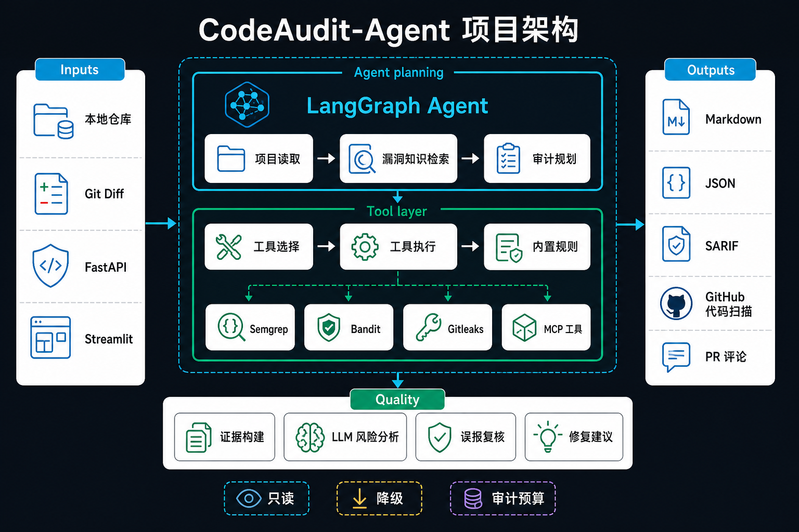
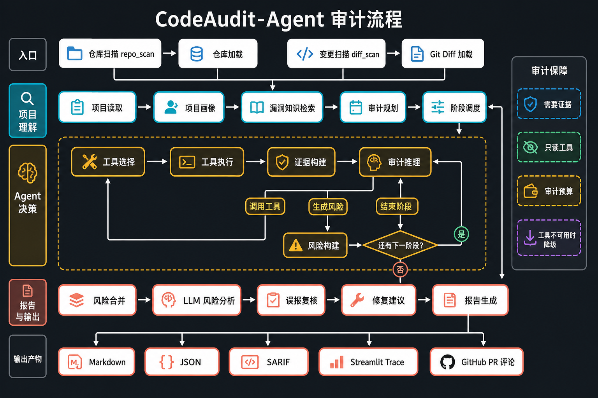

# CodeAudit-Agent

CodeAudit-Agent 是一个基于 LangGraph 的源码安全审计与 Git diff 风险分析 Agent。系统先理解项目结构和风险面，再结合漏洞知识库规划审计阶段，通过统一工具网关执行内置规则或外部安全工具，并由 LLM 围绕真实代码证据主动补充审计、复核风险和生成修复建议。

项目提供 FastAPI 接口、Streamlit 演示页面，以及 Markdown、JSON、SARIF 结构化审计结果。

## 核心能力

- 项目源码理解：识别语言、框架、依赖、入口、路由、认证、数据库和文件上传模块。
- 双模式审计：支持本地仓库 `repo_scan` 和 Git 变更 `diff_scan`。
- 漏洞知识检索：根据项目画像匹配注入、密钥泄露、命令执行、路径穿越、反序列化和访问控制知识。
- 动态审计规划：根据风险面生成 secret、injection、command、file、auth 等审计阶段。
- 受控工具调用：通过 Tool Registry、Tool Selector 和 Tool Executor 统一管理扫描工具。
- 主动补充取证：LLM 根据现有证据决定继续调用工具、形成 finding 或结束当前阶段。
- 风险质量控制：合并多工具结果，完成风险分析、误报复核和修复建议。
- 可解释执行：记录审计计划、工具选择原因、条件分支、fallback 和 Agent trace。

## Agent 架构

### 项目结构



### 审计流程



系统采用“项目理解、阶段规划、工具执行、证据推理、质量复核”五步主线：

```text
router
  -> input_loader
  -> project_reader
  -> vulnkb_retriever
  -> audit_planner
  -> stage_scheduler
  -> tool_selector
  -> tool_executor
  -> evidence_builder
  -> audit_reasoner
       |-- CALL_TOOL ------> tool_selector -> tool_executor -> evidence_builder
       |                                            ^                  |
       |                                            +------------------+
       |-- EMIT_FINDING ---> finding_builder -> audit_reasoner
       |-- FINISH_STAGE ---> stage_finalize
                                |-- HAS_NEXT_STAGE -> stage_scheduler
                                |-- ALL_FINISHED --> finding_merger
                                                       -> finding_assessor
                                                       -> fix_advisor
                                                       -> reporter
```

工作流包含两个受控循环：

- 工具调用内循环：证据不足时，Audit Reasoner 请求更多源码上下文或安全工具结果。
- 审计阶段外循环：完成当前风险阶段后，Stage Scheduler 切换到下一阶段。

每个阶段都受到工具调用轮次、目标文件数、上下文行数、Token 和耗时预算限制，避免无限循环和成本失控。

详细设计见 [docs/design.md](docs/design.md)。

## Agent 如何工作

### 1. 理解项目

Project Reader 读取文件树、构建文件和有限源码内容，生成 `ProjectProfile`：

```text
languages / frameworks / dependency_files / entrypoints
route_files / auth_files / db_files / upload_files
risk_surfaces / security_signals / profile_scope
```

项目画像只描述项目结构和审计线索，不直接产生漏洞结论。

### 2. 检索知识与规划阶段

VulnKB Retriever 根据语言、框架、风险面和用户任务检索本地漏洞知识。Audit Planner 将知识命中转换为 `AuditPlan`，描述风险阶段、目标文件、所需能力和证据目标。

Planner 面向能力进行规划，例如 `scan_sql_patterns` 或 `extract_call_chain`，不直接拼接命令或决定外部工具参数。

### 3. 选择并执行工具

Tool Selector 根据 `config/security_tools.yaml` 将能力映射到具体工具，并检查语言、扫描模式、目标路径、安装状态和只读权限。

工具分为两类：

- 内置工具：Secret Scanner、Custom Rule Scanner、Context Extractor。
- 外部适配器：Semgrep、Bandit、Gitleaks，以及通过 MCP Adapter 接入的工具。

外部工具不可用时自动记录 skipped 或 fallback，并切换到对应的内置规则。

### 4. LLM 主动审计

Audit Reasoner 不会无约束读取整个仓库，而是围绕当前风险阶段、工具结果和 Evidence 做结构化决策：

```text
CALL_TOOL     证据不足，继续调用受控工具
EMIT_FINDING  证据充分，形成候选风险
FINISH_STAGE  当前阶段完成或预算耗尽
```

LLM finding 必须引用真实 `evidence_id`、文件路径和代码行号。没有证据的推测只保留为审计假设，不进入最终报告。

### 5. 复核与报告

Finding Merger 对内置规则、外部工具和 LLM finding 去重。Finding Assessor 批量完成风险解释和误报复核，Fix Advisor 生成与语言、框架和上下文匹配的修复建议。

## 扫描模式

### `repo_scan`

读取本地项目目录，生成完整项目画像，并允许围绕必要的跨文件调用关系进行审计。

```json
{
  "repo_path": "D:/project/demo-app"
}
```

### `diff_scan`

支持直接传入 unified diff，也支持从本地仓库读取 staged 或 HEAD diff。

```json
{
  "diff_text": "diff --git a/app.py b/app.py\n..."
}
```

```json
{
  "repo_path": "D:/project/demo-app",
  "diff_mode": "cached"
}
```

有仓库路径时，系统补充读取依赖文件和必要上下文；只有 diff 文本时，报告会标记为 `diff_only` 并降低跨文件结论置信度。

diff 报告区分：

- `changed_line_finding`：风险直接位于新增或修改行。
- `context_related_finding`：历史代码风险被本次变更调用、触发或暴露。

## 项目结构

```text
app/
  cli.py            本地与 CI 命令入口
  agent/            LangGraph 状态、节点、图和 Agent 工具
  api/              FastAPI 扫描与报告接口
  context/          源码上下文和证据提取
  diff/             Git diff 读取与解析
  integrations/     GitHub PR 摘要等平台集成
  scanners/         Python/Java 内置安全规则
  security_tools/   工具注册、选择、执行和外部适配器
  reporting/        Markdown、JSON 与 SARIF 报告渲染
  schemas/          Pydantic 结构化模型
  storage/          报告存储与保留策略
  utils/            文件过滤和 trace

config/
  security_tools.yaml
  mcp_servers.json

.github/workflows/
  codeaudit.yml     Code Scanning 与 PR 审计

knowledge_base/     本地漏洞知识库
frontend/           Streamlit 演示页面
data/sample_repos/  演示项目与示例 diff
docs/design.md      完整系统设计说明
tests/              自动化测试
```

## 快速开始

### 1. 创建环境

```powershell
python -m venv .venv
.\.venv\Scripts\Activate.ps1
pip install -r requirements.txt
```

Bandit 是可选的 Python 外部工具，需要时安装：

```powershell
pip install bandit
```

Semgrep 和 Gitleaks 按各自平台的官方方式安装，并确保 `semgrep`、`gitleaks` 命令位于 `PATH`。外部工具未安装时，系统会记录 fallback 并使用内置规则继续审计。

Windows 环境中，如果 Semgrep 安装在当前 Python 环境，工具适配器会优先调用包内的 `semgrep-core.exe`，绕过可能较慢的 CLI 包装层；Linux 和 macOS 继续使用标准 `semgrep scan` 命令。

### 2. 配置环境变量

```powershell
Copy-Item .env.example .env
```

不配置 LLM 也可以运行基础扫描。需要启用 LLM 时填写：

```env
CODEAUDIT_REPORT_DIR=data/reports

LLM_API_KEY=your_api_key
LLM_BASE_URL=https://api.openai.com/v1
LLM_MODEL=gpt-4o-mini
LLM_TIMEOUT_SECONDS=30
```

系统支持 OpenAI-compatible Chat Completions 接口，也会在 `LLM_API_KEY` 为空时读取 `OPENAI_API_KEY`。

不要提交 `.env`、API key、访问令牌或其他真实凭据。

### 3. 启动 Streamlit Demo

```powershell
streamlit run frontend/streamlit_app.py
```

默认地址：

```text
http://localhost:8501
```

页面可以直接使用：

```text
data/sample_repos/small_python_app
data/sample_repos/sample.diff
```

### 4. 启动 FastAPI

```powershell
uvicorn app.main:app --reload
```

API 地址和交互文档：

```text
http://127.0.0.1:8000
http://127.0.0.1:8000/docs
```

### 5. 命令行与 CI

仓库扫描和 diff 扫描可以直接从命令行运行：

```powershell
python -m app.cli repo --repo-path . --metadata-file data/reports/latest.json
python -m app.cli diff --repo-path . --diff-file change.diff
python -m app.cli validate-sarif data/reports/<report_id>.sarif
```

`.github/workflows/codeaudit.yml` 在 push 时执行 `repo_scan`，在 Pull Request 时先运行真实 `git diff` 再执行 `diff_scan`。工作流会校验并上传 SARIF、保存完整报告，并在同仓库 PR 下更新一条脱敏摘要评论。fork PR 使用只读权限运行，不回写评论。

### 6. 接入 MCP 工具

MCP Adapter 支持 MCP 2025-11-25 stdio 工具服务器。复制 `config/mcp_servers.example.json` 中的配置，填写固定启动命令、允许透传的环境变量和 `allowed_tools` 白名单，再写入 `config/mcp_servers.json`。

MCP 工具需要在 `tools/list` 描述中声明：

- `annotations.readOnlyHint: true`，且不能声明破坏性行为。
- `inputSchema`，用于构造固定的 `mode`、`repo_path`、`target_files`、`risk_types` 或脱敏 `files` 参数。
- `_meta["io.codeaudit/tool"]`，用于声明语言、风险类型、能力和扫描模式。

发现后的工具会被映射为内部 `SecurityTool`，继续经过 Tool Selector、Tool Executor、目标路径校验、AuditBudget 和 fallback。系统不会把 LLM 生成的任意参数或 shell command 直接转发给 MCP Server。

## API 示例

### 扫描本地仓库

```http
POST /scan/repo
Content-Type: application/json

{
  "repo_path": "data/sample_repos/small_python_app"
}
```

### 扫描 Git diff

```http
POST /scan/diff
Content-Type: application/json

{
  "diff_text": "diff --git a/app.py b/app.py\n..."
}
```

### 查询报告

```http
GET /reports
GET /reports/{report_id}
```

## Web 演示界面

Streamlit 页面直接调用 Agent 工作流，展示长耗时审计任务的阶段进度、结构化结果、代码证据和完整报告。

页面按以下信息架构组织：

```text
侧边栏
  -> 扫描模式、仓库路径、diff 输入、LLM 与工具状态

执行概览
  -> 当前阶段、进度、耗时、工具调用数、finding 统计

主内容 Tabs
  -> 项目画像
  -> 审计计划
  -> 工具执行
  -> 风险与证据
  -> Agent Trace
  -> Markdown / JSON / SARIF 报告
```

执行过程中，页面通过 LangGraph 事件流持续更新阶段状态、工具调用和 Agent 决策。FastAPI 同时提供独立后端接口，供 CI 和其他系统调用。

## 报告输出

默认报告目录：

```text
data/reports/
  <report_id>.md
  <report_id>.json
  <report_id>.sarif
```

默认保留最近 100 份且不超过 30 天的报告，可通过以下变量调整：

```env
CODEAUDIT_REPORT_RETENTION_ENABLED=true
CODEAUDIT_REPORT_MAX_COUNT=100
CODEAUDIT_REPORT_MAX_AGE_DAYS=30
```

报告包含：

- 项目画像与画像完整度。
- 漏洞知识库命中。
- 审计阶段与工具选择理由。
- 工具执行结果和 fallback。
- Finding、Evidence 和来源。
- 风险分析、误报复核和修复建议。
- Agent trace、Token、耗时和调用统计。

## 安全边界

CodeAudit-Agent 只执行只读分析：

- 不执行被审计项目代码、测试、构建脚本或安装脚本。
- 不自动利用漏洞。
- 不自动修改或提交用户代码。
- 不允许 LLM 生成并直接执行 shell command。
- 外部工具只能通过注册表和固定适配器调用。
- 发给 LLM 的源码经过范围限制和 Secret 脱敏。
